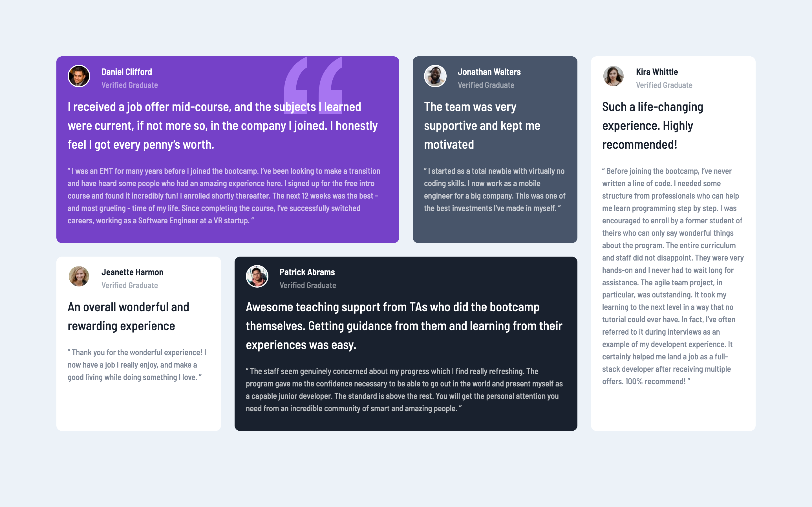

# Frontend Mentor - Testimonials grid section solution

This is a solution to the [Testimonials grid section challenge on Frontend Mentor](https://www.frontendmentor.io/challenges/testimonials-grid-section-Nnw6J7Un7). Frontend Mentor challenges help you improve your coding skills by building realistic projects.

## Table of contents

- [Overview](#overview)
  - [The challenge](#the-challenge)
  - [Screenshot](#screenshot)
  - [Links](#links)
- [My process](#my-process)
  - [Built with](#built-with)
  - [What I learned](#what-i-learned)
  - [Continued development](#continued-development)
  - [Useful resources](#useful-resources)
- [Author](#author)
- [Acknowledgments](#acknowledgments)

**Note: Delete this note and update the table of contents based on what sections you keep.**

## Overview

### The challenge

Users should be able to:

- View the optimal layout for the site depending on their device's screen size

### Screenshot



### Links

- Solution URL: [testimonials_grid_section_component_github](https://github.com/mayor-creator/testimonials_grid_section_component)
- Live Site URL: [testimonial_grid_section_vercel](https://testimonials-grid-section-component.vercel.app/)

## My process

### Built with

- Semantic HTML5 markup
- CSS sass properties
- Flexbox
- CSS Grid
- Mobile-first workflow

### What I learned

```css
.proud-of-this-css {
	color: papayawhip;
}
```

### Continued development

- exploring the grid-row-end properities.

### Useful resources

- [Responsive Desing](https://internetingishard.netlify.app/html-and-css/responsive-design/index.html#mobile-first-development) - This is an amazing article which helped me understand how to write media queries for tablet devices.

## Author

- Frontend Mentor - [@mayor-creator](https://www.frontendmentor.io/profile/mayor-creator)
- Twitter - [@mayor_creator](https://www.twitter.com/mayor_creator)

## Acknowledgments

- (<https://www.youtube.com/watch?v=rg7Fvvl3taU>) by kevin powell explaining css grid-template-columns.
